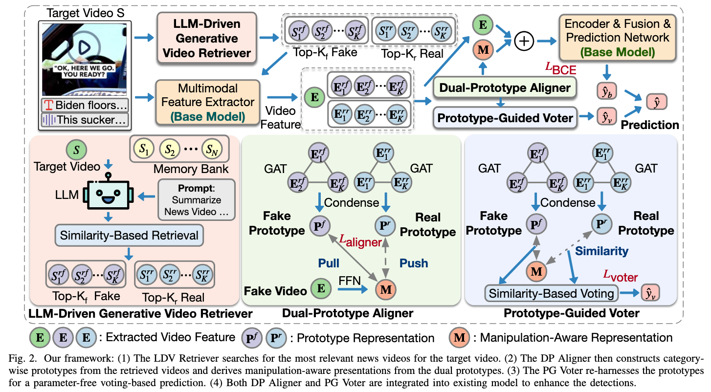

# REAL & REAL++: REtrieval-Augmented prototype aLignment ++ Prototype-Based Voting framework

This repo provides official implementations for papers: 

- *REAL: Retrieval-Augmented Prototype Alignment for Improved Fake News Video Detection*, accepted by ICME 2025.

- *REAL++: Retrieval-Augmented Prototype Alignment with
Prototype-Guided Voting for Enhanced Fake News Video Detection*, which is underreviewed.

## Abstract

### REAL

Detecting fake news videos has emerged as a critical task due to their profound implications in politics, finance, and public health. However, existing methods often fail to distinguish real videos from their subtly manipulated counterparts, resulting in suboptimal performance. To address this limitation,
we propose REAL, a novel model-agnostic REtrieval-Augmented prototype-aLignment framework. REAL first introduces an LLM-driven video retriever to identify contextually relevant samples for a given target video. Subsequently, a dual-prototype aligner is carefully developed to model two distinct prototypes: one representing authentic patterns from retrieved real news videos and the other encapsulating manipulation-specific patterns from fake samples. By aligning the target video’s representations with its ground-truth prototype while distancing them from the opposing prototype, the aligner captures manipulation-aware representations capable of detecting even subtle video manipulations. Finally, these enriched representations are seamlessly integrated into existing detection models in a plug-and-play manner. Extensive experiments on three benchmarks demonstrate that REAL largely enhances the detection ability of existing methods.

### REAL++

Fake news video detection is a critical research problem with significant implications.
Existing methods often overlook the subtle manipulations introduced by fake news creators, making it difficult to reliably distinguish authentic videos from their slightly altered counterparts. 
Moreover, these methods require frequent retraining on newly emerging news videos associated with breaking events in order to remain effective on out-of-distribution (OOD) instances, which is inefficient and unable to support real-time deployment.
To address these limitations, we first propose REAL, a novel model-agnostic framework designed to enhance existing detectors for identifying subtly manipulated news videos. 
Specifically, we introduce an LLM-driven generative video retriever that identifies semantically relevant reference videos from different categories for each input news video. 
Based on the retrieved references, we further design a Dual-Prototype Aligner that condenses the reference videos into category-specific prototypes, from which manipulation-aware representations are derived to effectively distinguish authentic videos from their subtly modified versions.
Building upon REAL, we further extend it to REAL++ by introducing a Prototype-Guided Voter that reuses the dual prototypes to perform parameter-free, voting-based prediction. 
This voter assists vanilla detectors in handling OOD news videos without requiring any additional training. 
Finally, both the aligner and the voter are seamlessly integrated into existing models in a plug-and-play manner to improve their detection capabilities.
Extensive experiments on three real-world news video datasets demonstrate the effectiveness of REAL and REAL++. 
In particular, REAL++ achieves an average improvement of 9.31% and 22.35% in Macro-F1 over all baseline detectors under in-domain and OOD scenarios, respectively.

## Framework

### REAL


### REAL++




## Source Code Structure

```sh
├── data    # dataset path
│   ├── FakeSV
│   ├── FakeTT
│   └── FVC
├── preprocess  # code for prepocessing data
│   ├── make_retrieval_tensor.py
│   ├── generate_caption_BLIP.py
│   ├── generate_query_text.py
├── retrieve    # code of conducting retrieval
│   └──conduct_retrieval.py
├── run         # script for preprocess and retrival
├── src         # code of model arch and training
│   ├── main.py     # main code for training 
│   ├── model
│   │   ├──Base
│   │   └──SVFEND    # implementation of SVFEND w/ REAL
└── └── utils
├── src-real++         # code of model arch and training
│   ├── main.py     # main code for training 
│   ├── model
│   │   ├──Base
│   │   └──SVFEND    # implementation of SVFEND w/ REAL++
└── └── utils
```

## Dataset

We provide video IDs for each dataset splits. Due to copyright restrictions, the raw datasets are not included. You can obtain the datasets from their respective original project sites.

+ [FakeSV](https://github.com/ICTMCG/FakeSV)
+ [FakeTT](https://github.com/ICTMCG/FakingRecipe)
+ [FVC](https://github.com/MKLab-ITI/fake-video-corpus)

## Usage

### Requirement

To set up the environment, run the following commands:

```sh
conda create --name REAL python=3.12
conda activate REAL
pip install -r requirements.txt
```

### Preprocess

1. Download datasets and store them in `data` presented in Source Code Structure, and save videos to `videos` in corresponding datasetpath.
2. For video dataset, save `data.jsonl` in each dataset path, with each line including vid, title, ocr, transcript, and label.
3. Run following codes to prepocess data:
```sh
bash run/retrieve.sh  # preprocess data and conduct retrieval
bash run/preprocess.sh  # preprocess data for SVFEND w/ REAL
```

### Run REAL
```sh
python src/main.py --config-name SVFEND_FakeSV.yaml     # run SVFEND w/ REAL on FakeSV
python src/main.py --config-name SVFEND_FakeTT.yaml     # run SVFEND w/ REAL on FakeTT
python src/main.py --config-name SVFEND_FVC.yaml        # run SVFEND w/ REAL on FVC
```

### Run REAL++
```sh
python src-real++/main.py --config-name SVFEND_FakeSV.yaml     # run SVFEND w/ REAL++ on FakeSV
python src-real++/main.py --config-name SVFEND_FakeTT.yaml     # run SVFEND w/ REAL++ on FakeTT
python src-real++/main.py --config-name SVFEND_FVC.yaml        # run SVFEND w/ REAL++ on FVC

python src-real++/cross_platform_eval.py --ckpt /path/to/best_model.pth --config-name SVFEND_FakeSV.yaml     # SVFEND w/ REAL++ trained on FakeSV evaluated on FakeTT and FVC

```


## Citation
If you find our research useful, please cite our papers:
```bib
@inproceedings{li2025real,
	author = {Li, Yili and Lang, Jian and Hong, Rongpei and Chen, Qing and Cheng, Zhangtao and Chen, Jia and Zhong, Ting and Zhou, Fan},
	booktitle = {IEEE International Conference on Multimedia and Expo (ICME)},
	year = {2025},
	organization = {IEEE},
	title = {REAL: Retrieval-Augmented Prototype Alignment for Improved Fake News Video Detection},
}
```
